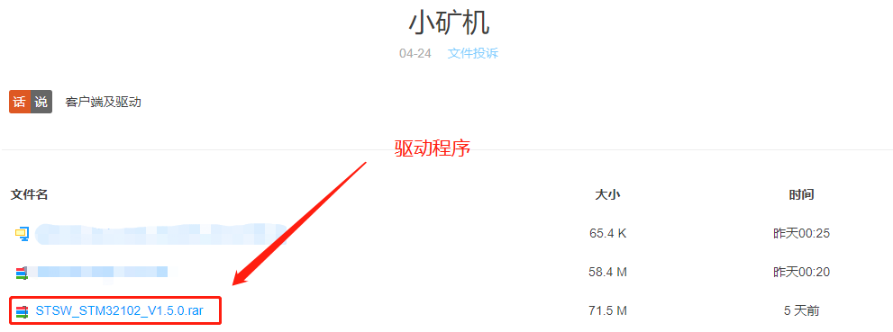
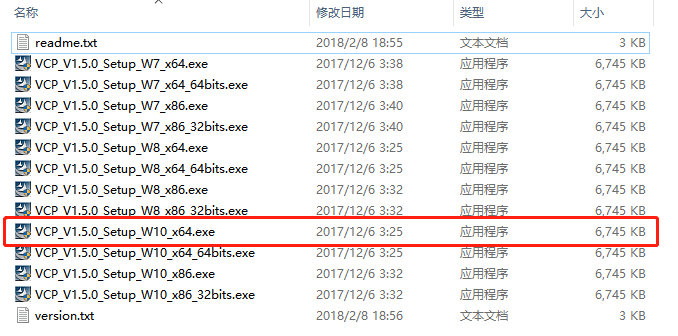
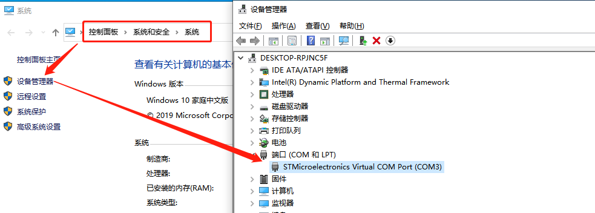

# USB 驱动安装说明

本驱动支持 Starcoin 小型矿机。
## 安装步骤
### 1 下载驱动文件并解压

下载地址：https://wwa.lanzous.com/b0f8fa5sh 密码: star

备用地址：[Starcoin矿机驱动](https://pan.baidu.com/s/1EBIiYLtSQ_07gY1eneM7Dw) 密码:chyz

### 2 驱动安装

在解压的文件包中找到电脑系统对应的驱动安装程序，如Win10系统选择VCP_V1.5.0_Setup_W10_x64.exe安装文件：

双击选择的驱动安装程序，根据安装向导提示，完成矿机驱动的安装。

### 3 设备识别验证

插入小矿机，确保在Windows的设备管理器中能找到设备：

