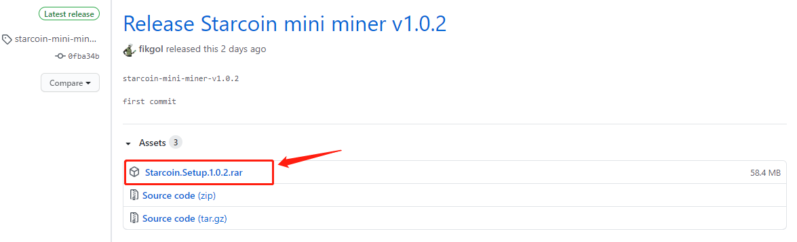
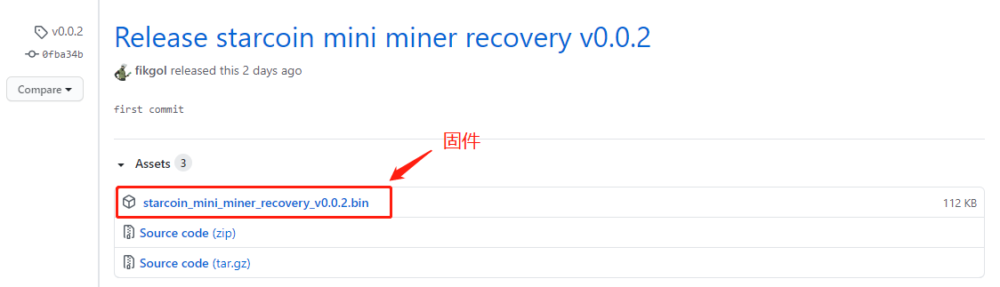
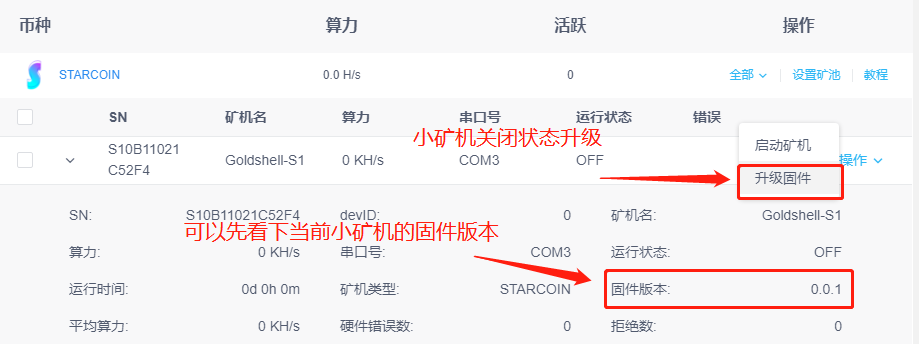
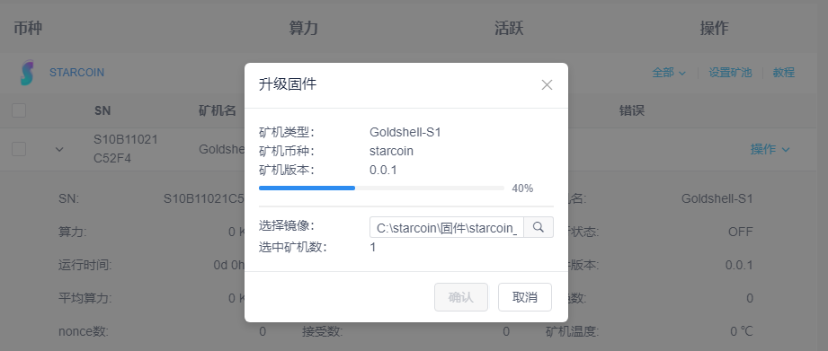
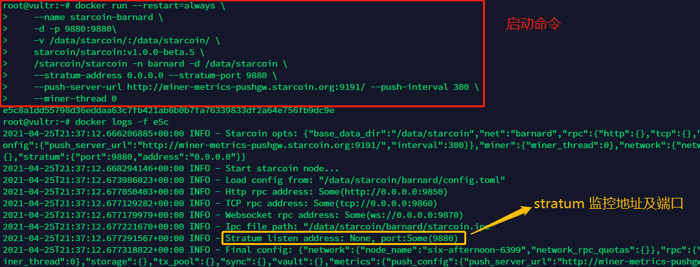
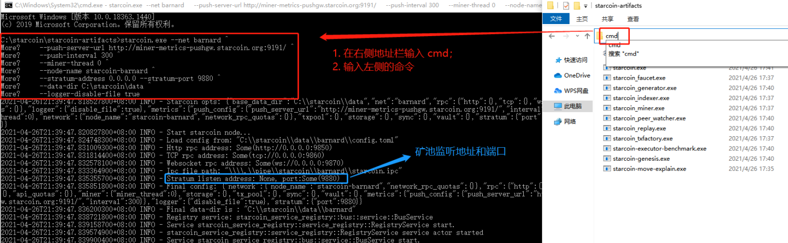
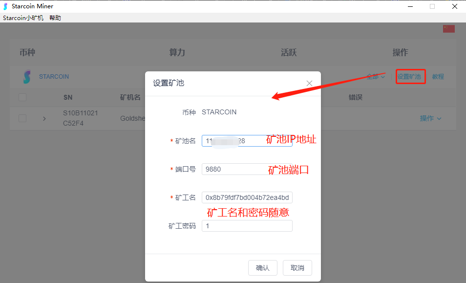
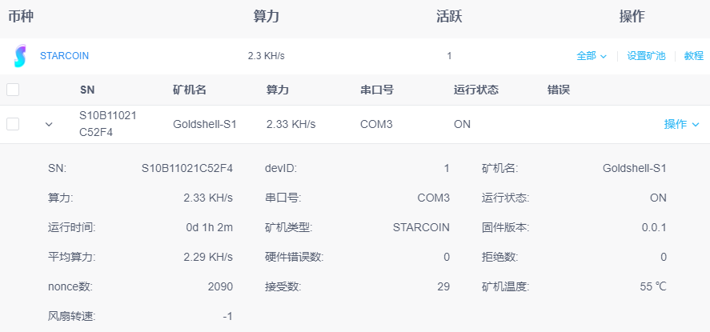

# Windows 桌面客户端

> 注意事项：
>
> * 本手册只适用于挖 Starcoin 币种，`测试网及主网均可`。不支持其他币种。
> * 使用前请尽量避免将矿机放置在空气流通性差和温度过高的环境下运行，否则可能导致工作异常甚至造成设备损坏。
> * 使用前请保证网络通畅，否则会造成拒绝率上升影响机器算力。
> * 使用时请勿私自超频，否则会导致芯片损坏，后果自负。
> * 该客户端软件暂时仅支持 windows 系统, 非 windows 系统用户使用此矿机请参考：[starcoin mint usb solver](https://github.com/fikgol/usbsolver)
> * 其余问题请添加 VX：Starcoinorg

## 一、安装驱动和桌面客户端

### 1.1 驱动安装

驱动程序下载及安装说明：[【USB 驱动安装说明】#安装步骤](/mi-ni-xing-kuang-ji/usb-qu-dong-an-zhuang-shuo-ming.html#安装步骤)

### 1.2 安装客户端

最新客户端下载地址：[Starcoin 挖矿客户端](https://github.com/starcoinorg/starcoin_mini_miner/releases/latest)

下载客户端文件并解压安装：



### 1.3 固件更新

更新固件: 软件识别出矿机后，点击更新固件。将 [Starcoin mini 矿机固件](https://github.com/starcoinorg/starcoin_mini_miner/releases/tag/v0.0.2) 下载后上传

下载客户端文件并解压：



电脑连接小矿机后，查看小矿机固件，如果低了，可以升级固件：




选择好固件后，就开始升级啦！




## 二、启动矿池节点

支持测试网的矿池将于4月26日陆续开放（请留意本页面更新）。

### 2.1 Docker 版启动命令

`注意软件版本大于 v1.0.0-beta.5 及以上`

如果使用的云服务器，请在安全组开放 9880 端口！否则小矿机连不上

> 节点升级教程：
>
> - Docker：[升级/迁移 Starcoin Docker 节点](/node-start/docker/upgrade-or-migration-node-on-docker.html)

```shell
$ sudo docker run --restart=always \
     --name starcoin-barnard \
     -d -p 9880:9880\
     -v /data/starcoin/:/data/starcoin/ \
     starcoin/starcoin:v1.0.0-beta.6 \
     /starcoin/starcoin -n barnard -d /data/starcoin \
     --stratum-address 0.0.0.0 --stratum-port 9880 \
     --push-server-url http://miner-metrics-pushgw.starcoin.org:9191/ --push-interval 300 \
     --miner-thread 0
```

> 小提示：
>
> - `-p 9880:9880`：指将宿主机 9880（冒号左侧）和容器内 9880（冒号右侧）端口映射，这样外部访问 9880 端口流量才会进入容器内的应用；
> - `--stratum-address 0.0.0.0`：设置矿池监听的 IP；
> - `--stratum-port 9880`：设置矿池监听端口；如需修改，记得改前面的 -p 参数；
> - `--miner-thread 0`：因为矿池节点可以不挖，这里设置成0，如果需要节点也需要挖，修改线程数即可；



出现 Stratum listen address: None, port:Some(9880) 说明就启动完成了。


### 2.2 Windows 版启动命令

`注意升级软件版本至 v1.0.0-beta.5 及以上`

如果使用的云服务器，请在安全组开放 9880 端口！否则小矿机连不上

> 节点升级教程：
>
> - Windows：[Win10 升级/迁移 Starcoin 节点](/node-start/windows/upgrade-or-migration-node-on-win10.html)

```bash
starcoin.exe --net barnard ^
    --push-server-url http://miner-metrics-pushgw.starcoin.org:9191/ ^
    --push-interval 300 ^
    --miner-thread 0 ^
    --node-name starcoin-barnard ^
    --stratum-address 0.0.0.0 --stratum-port 9880 ^
    --data-dir C:\starcoin\data ^
    --logger-disable-file true
```

截图如下：




## 三、连接矿池

### 3.1 检查矿池节点端口是否开放

检查目的：小矿机连接矿池节点，需要节点放开 9880 端口


#### 3.1.1 云服务器节点测试方法

前提：服务器中节点是启动运行的（节点版本>=beta.5），并且安全组放行了 9880 端口。

扫描端口：http://tool.chinaz.com/port/


#### 3.1.2 Windows 本地端口测试方法

前提：本地节点是启动运行的（节点版本>=beta.5）

使用 netstat 命令：

```shell
netstat -ano
```


### 3.2 小矿机上线

小矿机连上电脑，桌面客户端设置矿池：

`矿池名`：填写云服务器 IP，如果是本地节点可写 localhost 或 127.0.0.1；

`端口号`：9880；

`矿工名`：这个随意写，目前没影响；

`矿工密码`：这个`必填`的，随意写，没影响；



### 3.3 演示

1. 开始挖矿：点击启动矿机，等待片刻后能够看到有算力生成证明设备已开始工作。
2. 切换矿池：选择机器停止挖矿，设置矿池，开始挖矿。



