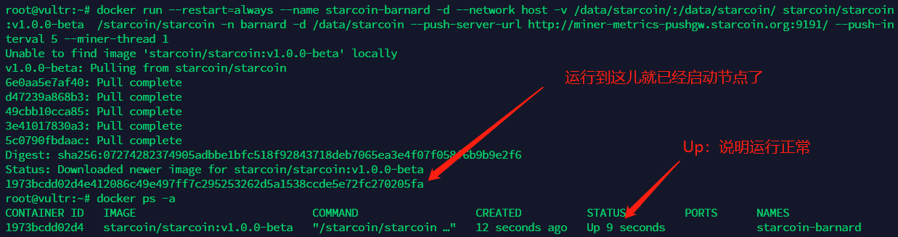
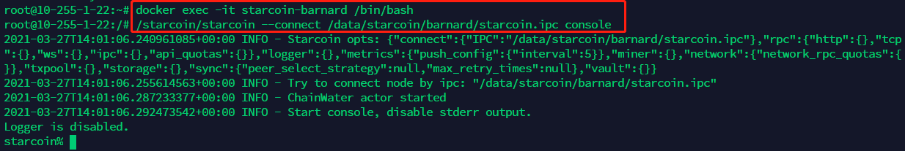
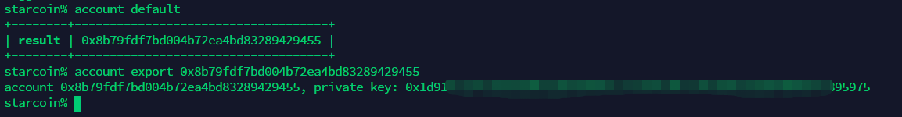
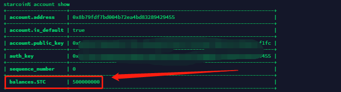
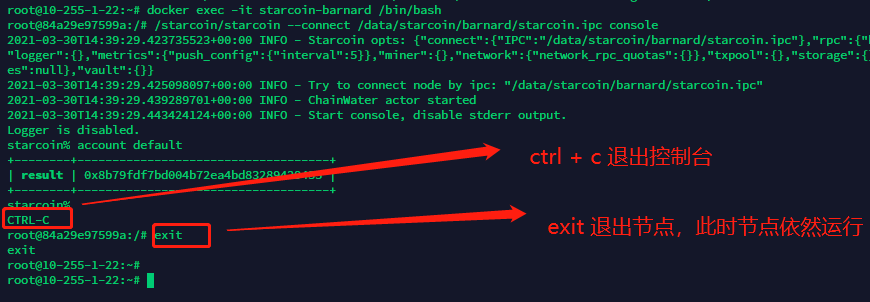

# Docker 运行 Starcoin 节点

## 一、准备工作

已安装 Docker 的 Ubuntu/CentOS 等系统，且 docker 是运行状态；

Mac 可安装 Docker for Mac；Windows 10 专业版可安装 Docker for Windows；非专业版或低版本 Win 系统可安装 Docker ToolBox。

## 二、运行节点

执行如下命令运行节点：

```shell
$ sudo docker run --restart=always \
    --name starcoin-barnard \
    -d \
    -v /data/starcoin/:/data/starcoin/ \
    starcoin/starcoin:v1.0.0-beta.5 \
    /starcoin/starcoin -n barnard \
    -d /data/starcoin \
    --push-server-url http://miner-metrics-pushgw.starcoin.org:9191/ --push-interval 120 \
    --miner-thread 1
```

> 注：
>
> 如需启动矿池节点，需要映射容器端口 9880，并在最后加参数：--stratum-address 0.0.0.0 --stratum-port 9880；
>
> 启动矿池节点命令可以查看文档：[【挖矿说明】2.1 Docker 版启动命令](/mi-ni-xing-kuang-ji/wa-kuang-shuo-ming.html#2.1 Docker 版启动命令)


查看节点运行状态：

```shell
$ sudo docker ps -a
```



> 注：
>
> - `--miner-thread`参数可用来指定线程，请根据自己节点的配置信息调整。

## 三、导出账号及私钥

### 3.1 进入节点并连接Starcoin控制台

进入节点：

```shell
$ sudo docker exec -it starcoin-barnard /bin/bash
```

连接控制台，看到最后返回 `starcoin%` 就说明成功到控制台了：

```shell
/starcoin/starcoin --connect /data/starcoin/barnard/starcoin.ipc console
```



> 小提示：
>
> - 如果进入 console 的命令执行报错，不要着急，继续往下看。
> - 进入节点后，退出命令：exit。

### 3.2 查看账号并导出私钥

> 前提：
>
> - 连接Starcoin控制台

查看默认账号：

```
account default
```

`导出默认账号的私钥`：

```
account export 0x8b79fdf7bd004b72ea4bd83289429455
```

如下图所示，导出了 account 和 private key（私钥），`私钥一定要保存！！！`



### 3.3 查看账号余额

这里只给下命令，如果返回了 balances.STC 说明有出块，精度 9 位；

```
account show 0x8b79fdf7bd004b72ea4bd83289429455
```



### 3.4 退出节点和控制台

看截图：

```
$ exit
```



## 四、区块浏览器

地址：[http://explorer.starcoin.org](http://explorer.starcoin.org/)

