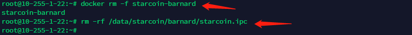
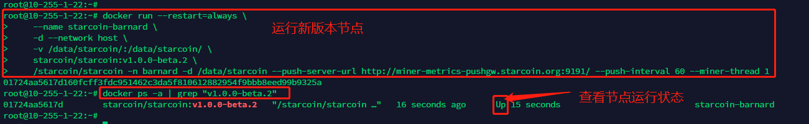
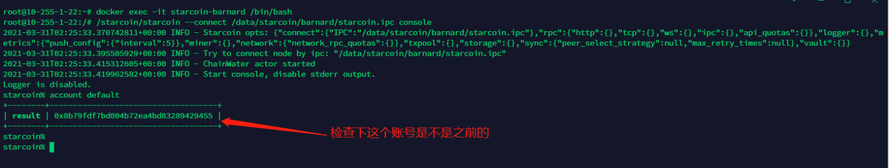

# Docker 升级/迁移 Starcoin 节点

## 一、准备工作

`必须先导出原节点私钥！！！`

准备好私钥，用于导入节点账号。

## 二、停止原节点

如果是迁移节点，可跳过该步骤

停止并删除原节点：

```shell
$ docker rm -f starcoin-barnard
```

删除原节点 ipc 文件：

```shell
$ rm -rf /data/starcoin/barnard/starcoin.ipc
```

该步骤操作截图如下：



## 三、启动新节点

> 注：
>
> 如需启动矿池节点，需要映射容器端口9880，并在最后加参数：--stratum-address 0.0.0.0 --stratum-port 9880；
>
> 启动矿池节点命令查看文档：[【挖矿说明】2.1 Docker 版启动命令](/mi-ni-xing-kuang-ji/wa-kuang-shuo-ming.html#2.1 Docker 版启动命令)

```shell
# 运行新版本
$ sudo docker run --restart=always \
    --name starcoin-barnard \
    -d \
    -v /data/starcoin/:/data/starcoin/ \
    starcoin/starcoin:v1.0.0-beta.6 \
    /starcoin/starcoin -n barnard -d /data/starcoin --push-server-url http://miner-metrics-pushgw.starcoin.org:9191/ --push-interval 300 --miner-thread 1

# 查看节点运行状态
$ docker ps -a
```

操作截图：



> 小提示：
>
> - v1.0.0-beta.2 是教程截图时演示的，实际应替换成当前最新的版本号；

## 四、导入私钥并设为默认账号

检查新版本默认账号：

```
$ docker exec -it starcoin-barnard /bin/bash

> /starcoin/starcoin --connect /data/starcoin/barnard/starcoin.ipc console

% account default
```

截图如下：



如果上面的账号是自己之前的，就结束了，如果账号不对，重新设置：

导入私钥：

```
% account import -i 私钥
```

设置为默认账号：

```
% account default 私钥对应的账号
```