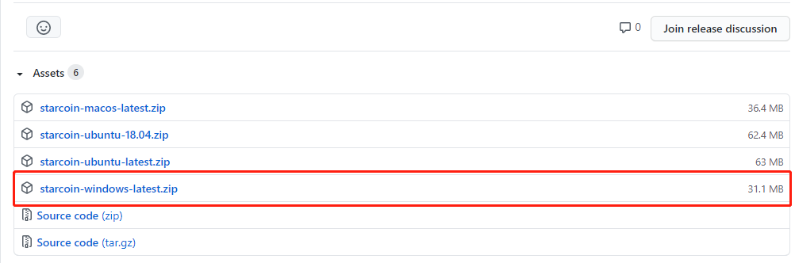
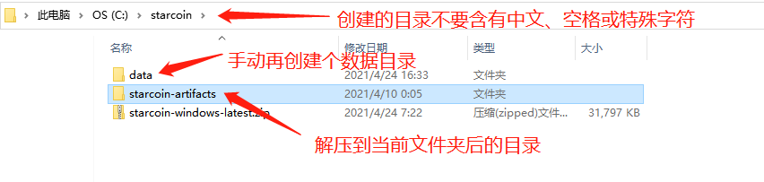
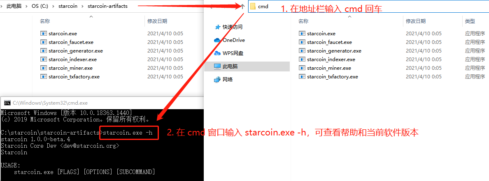
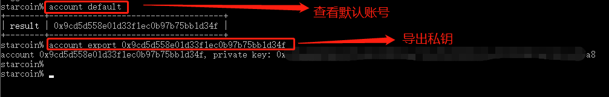
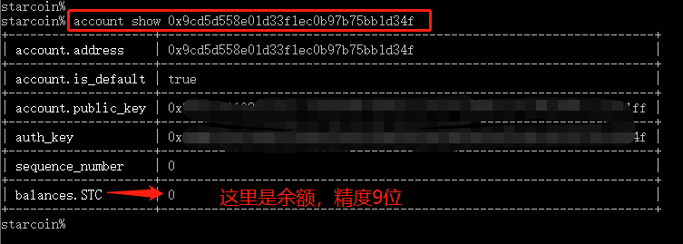
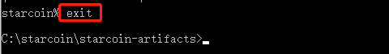
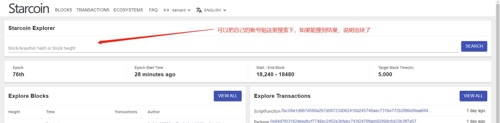

# Win10 运行 Starcoin 节点

## 一、下载最新版本的软件

最新的版本链接：[https://github.com/starcoinorg/starcoin/releases/latest](https://github.com/starcoinorg/starcoin/releases/latest)



## 二、新建目录及解压压缩文件

新建的目录`不要出现中文、空格以及特殊字符`。

另外准备个数据目录；

完成的结果如下：



## 三、运行节点

### 3.1 查看命令帮助

进入解压后的"starcoin-artifacts"目录，在地址栏中输入 cmd 并回车（目录下要有 starcoin.exe），并在命令提示符下输入如下命令：

如果运行命令后，有弹窗提示权限，请允许。

> 注意：
>
> - 教程后面进入 cmd 窗口，若未做特殊说明，都是在解压后的目录中进入；

```
starcoin.exe -h
```

该命令是查看帮助，第一行会返回软件版本，命令截图如下：



### 3.2 运行节点

```bash
starcoin.exe --net barnard ^
    --push-server-url http://miner-metrics-pushgw.starcoin.org:9191/ ^
    --push-interval 600 ^
    --miner-thread 2 ^
    --node-name starcoin-barnard ^
    --data-dir C:\starcoin\data ^
    --logger-disable-file true
```

> 注：
>
> 如需启动矿池节点，需要在最后加参数：--stratum-address 0.0.0.0 --stratum-port 9880；
>
> 启动矿池节点具体命令可以查看文档：[【挖矿说明】#2.2 Windows 版启动命令](/mi-ni-xing-kuang-ji/wa-kuang-shuo-ming.html#2.2 Windows 版启动命令)

命令解释：

- 每行结尾的 ^：表示命令未结束，需要换行；
- `--miner-thread`：线程数，可适当调节；
- `--node-name`：节点名称，随意；
- `--data-dir`：数据存放目录，这里 C:\starcoin\data 是第二步中创建的 data 目录，可根据情况修改；

操作演示：


抓一下重点：

- 重点1

  目前还没用到，先记录下。

  - Http rpc address: Some(http://0.0.0.0:9850)

  - TCP rpc address: Some(tcp://0.0.0.0:9860)
  - Websocket rpc address: Some(ws://0.0.0.0:9870)

- 重点2

  这个很重要！！！后面会用来连接控制台、导出私钥等，所以一定要关注~

  - Ipc file path: \\.\pipe\starcoin\barnard\starcoin.ipc

- 重点3

  数据目录，迁移节点可以复制用来，减少区块同步耗时。

  - Final data-dir is : C:\starcoin\data\barnard

## 四、导出账号及私钥

### 4.1 连接Starcoin控制台

`前提：节点运行中`

连接控制台，看到最后返回 `starcoin%` 就说明成功到控制台了：

```bash
starcoin.exe -c \\.\pipe\starcoin\barnard\starcoin.ipc console
```


> 小提示：
>
> - `\\.\pipe\starcoin\barnard\starcoin.ipc`：这个 ipc 文件，就是启动节点时返回的；

### 4.2 查看账号并导出私钥


> 前提：
>
> - 连接 Starcoin 控制台，见上一步


查看默认账号：

```shell
account default
```

导出默认账号的私钥：

```shell
account export 0x9cd5d558e01d33f1ec0b97b75bb1d34f
```

如下图所示，导出了 account 和 private key（私钥），私钥一定要保存！！！



### 4.3 查看账号余额

这里只给下命令，如果返回了 balances.STC 说明有出块，精度 9 位；

```
account show 0x9cd5d558e01d33f1ec0b97b75bb1d34f
```



### 4.4 退出控制台

看截图：

```
$ exit
```




## 五、区块浏览器

地址：[http://explorer.starcoin.org](http://explorer.starcoin.org/)



