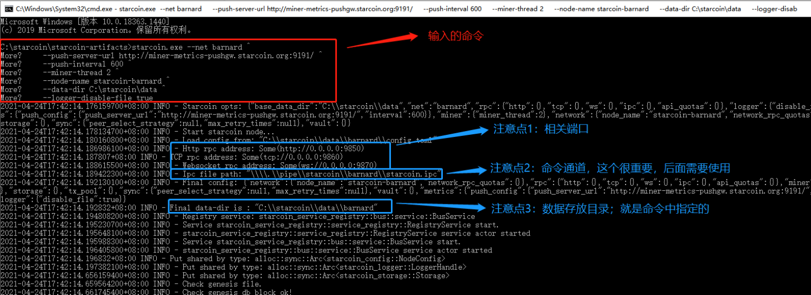
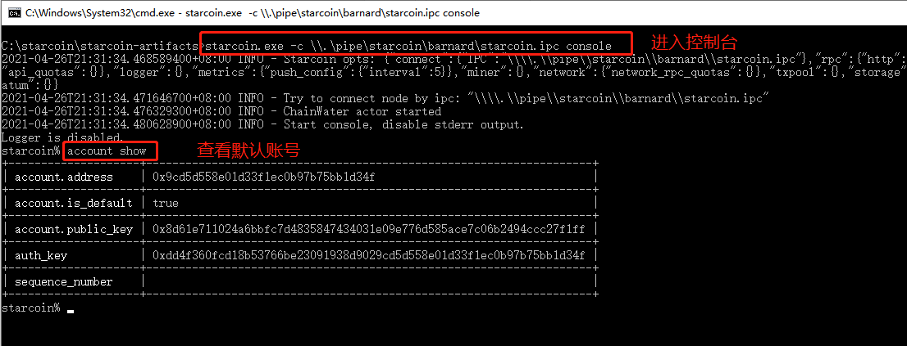

# Win10 升级/迁移 Starcoin 节点

# 一、准备工作

`必须先导出原节点私钥！！！`

私钥导出教程：[【Win10 运行 Starcoin 节点】#四、导出账号及私钥](/node-start/windows/run-node-on-win10.html#四、导出账号及私钥)

准备好私钥，用于导入节点账号。

# 二、停止原节点

`如果是迁移节点，可跳过该步骤`

停止原节点：在启动节点的 cmd 窗口按 Ctrl 键 + c 键。

# 三、启动新节点

将下载好的压缩包解压覆盖上个版本的文件即可；

注：

如需启动矿池节点，需要在最后加参数：--stratum-address 0.0.0.0 --stratum-port 9880；

启动矿池节点命令查看文档：[【挖矿说明】#2.2 Windows 版启动命令](/mi-ni-xing-kuang-ji/wa-kuang-shuo-ming.html#2.2 Windows 版启动命令)

```bash
starcoin.exe --net barnard ^
    --push-server-url http://miner-metrics-pushgw.starcoin.org:9191/ ^
    --push-interval 600 ^
    --miner-thread 2 ^
    --node-name starcoin-barnard ^
    --data-dir C:\starcoin\data ^
    --logger-disable-file true
```

操作截图：



# 四、导入私钥并设为默认账号

连接控制台（前提：节点运行中）：

```bash
starcoin.exe -c \\.\pipe\starcoin\barnard\starcoin.ipc console
```

检查新版本默认账号：

```
account default
```

截图如下：



如果上面的账号是自己之前的，就结束了，如果账号不对，参考下面的命令继续设置：

导入私钥：

```
% account import -i 私钥
```

设置为默认账号：

```
% account default 私钥对应的账号
```

