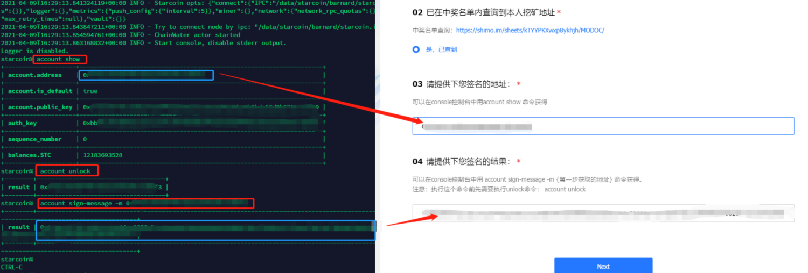

# Starcoin测试网第二期活动奖励领取

# 一、中奖查询

文档地址：https://shimo.im/sheets/kTYYPKXwxp8ykhjh/MODOC

确认下自己的地址在不在名单中。

# 二、升级客户端软件

将软件升级到 v1.0.0-beta.6，`必须高于 beta.4`；


教程：

- Docker 节点：[Docker 升级/迁移 Starcoin 节点](/node-start/docker/upgrade-or-migration-node-on-docker.html)
- Windows 节点：[Win10 升级/迁移 Starcoin 节点](/node-start/windows/upgrade-or-migration-node-on-win10.html)

# 三、命令及提交表单

进入 starcoin 控制台，前提是节点运行中，执行如下命令：

```
% account show

% account unlock

% account sign-message -m <这里填地址>
```

> 不知道如何进入？可参考如下教程：
>
> - Docker 节点进入控制台：[Docker 运行 Starcoin 节点#3.1 进入节点并连接Starcoin控制台](/node-start/docker/run-node-on-docker.html#3.1 进入节点并连接Starcoin控制台)
> - Windows 节点进入控制台：[Win10 运行 Starcoin 节点#4.1 连接Starcoin控制台](/node-start/windows/run-node-on-win10.html#4.1 连接Starcoin控制台)

完整的命令及截图如下：

